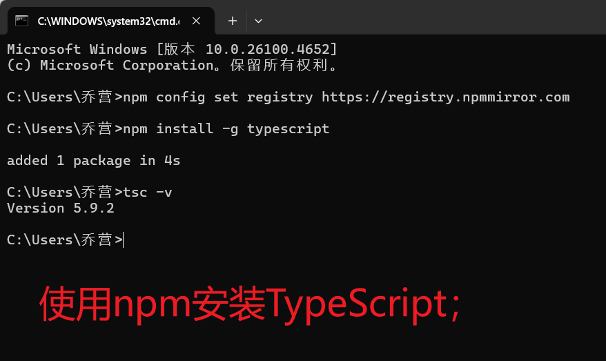

# 学习网站：  https://www.runoob.com/typescript/ts-features.html
// 第一个TypeScript 实例：
ts 代码：
```typescript
const hello : string = 'hello world'
console.log(hello)
```

 # 首先是安装typescript


在运行typescript转换为 javascript代码：
```typescript
 tsc app.ts 
```
运行结束之后，会在当前目录下生成一个app.js文件

使用node运行app.js文件： node app.js

TypeScript 提供了 interface 和 type 关键字 ;
ts 会根据声明的变量的赋值来推断变量的类型，不需要声明变量的类型。

